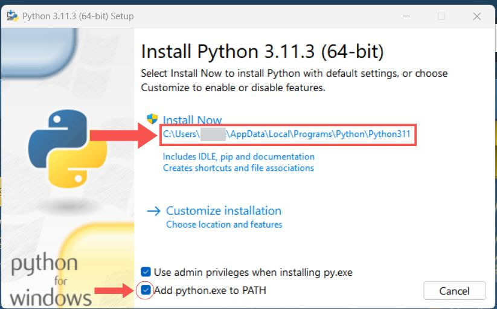
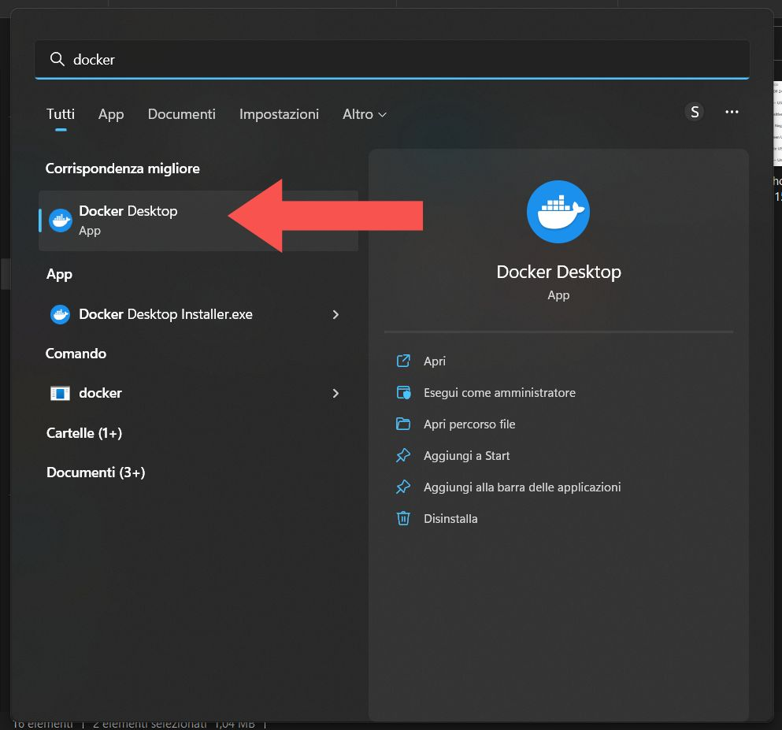
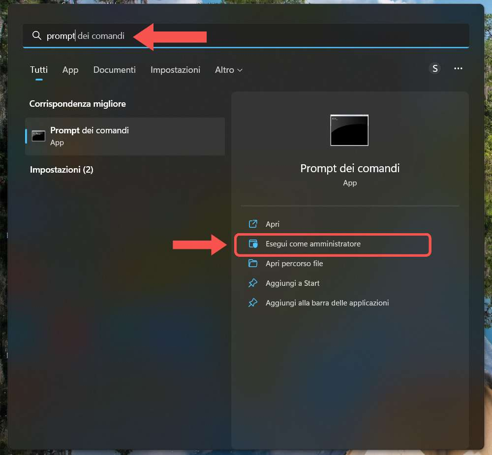
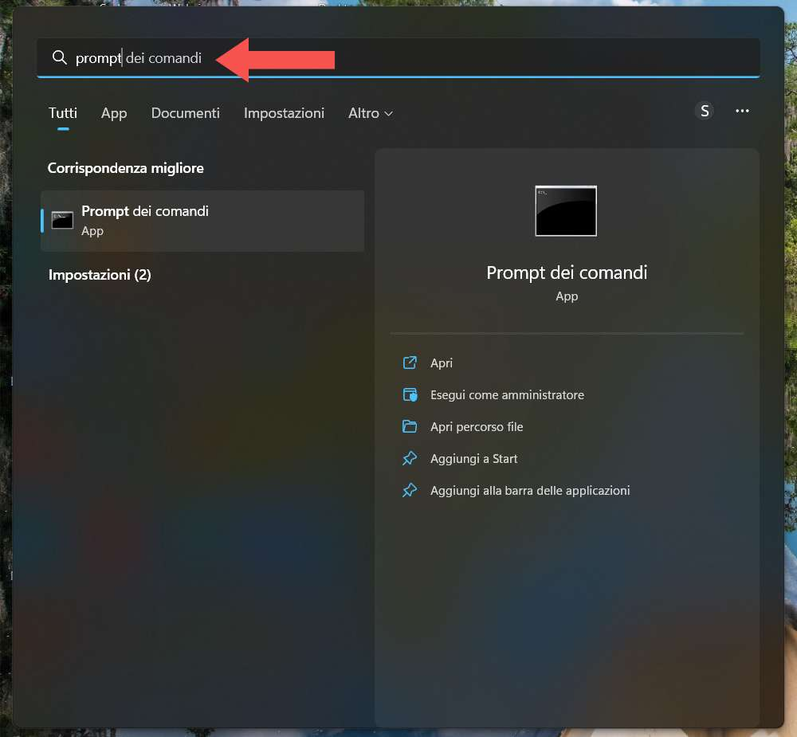
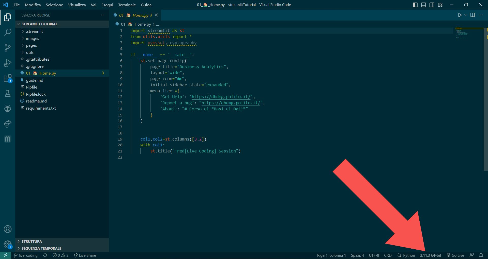
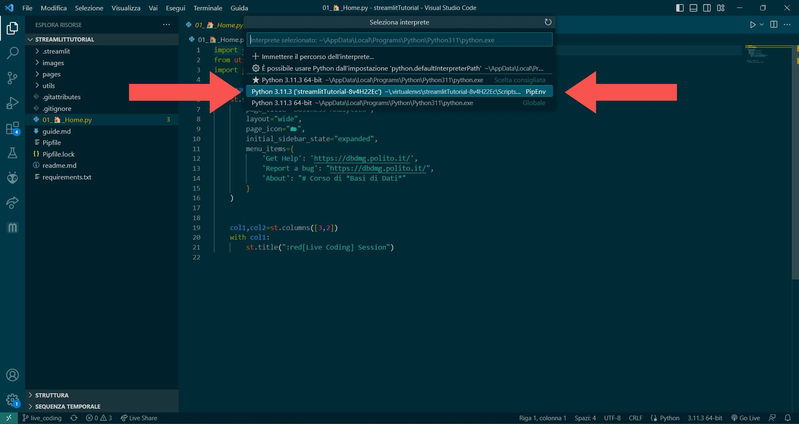

# Streamlit on Windows

## 1. Preparation
- Install [Docker Desktop](https://www.docker.com/products/docker-desktop/)

- Install [Python3](https://www.python.org/downloads/)

:warning: If you have Python 3.9.7, you will need to reinstall the latest version as it is not supported by Streamlit :warning:\
:warning: Do not install a Python version >3.11. For now, Streamlit supports versions from 3.7 to 3.11 (with exceptions) :warning:

Check the installation settings (as shown in the picture).\
**Note down the installation path highlighted in the picture.**\
Also, make sure to activate "Add Python.exe to PATH".

Now you can install Python\


- Install [git](https://git-scm.com/download/win), selecting the Windows 64bit standalone version (you can leave all the default settings during installation)

- **RESTART THE COMPUTER**

- Start Docker Desktop\


:warning: :warning: :warning:\
if starting Docker gives an error regarding an update, use the command prompt AS ADMINISTRATOR and execute:
```bash
wsl --update --web-download
```


Restart Docker Desktop and wait for it to finish loading before executing the next commands

:warning: :warning: :warning:

<br>

## 2. Command Prompt
OgniEach command should be executed in the command prompt, pressing ENTER to run it. A command is running until it returns the name of the current directory and the `>` symbol. (eg. `C:\Users\<username>`)\
Let the command execute until it finishes before entering another one. Some commands, like installing requirements with `pip`, may take several minutes.

To open the correct prompt:

``` bash
mkdir bdd_streamlit
cd bdd_streamlit
git clone https://github.com/Cryst4lDr4g0n/mysql-docker.git
cd mysql-docker
docker compose up -d
```

With these commands, we created th `bdd_streamlit` folder (inside the path `C:\Users\<username>`)  which will contain all our Streamlit project files. With the last command, we started the Docker containers for the `mysql` DB and the `phpmyadmin` web interface. The `phpmyadmin` interface is available at `http://localhost:8081` accessible with username `student` and password `user_pwd`\
((these can be modified via the `.env` file in the `mysql-docker` folder, after stopping and restarting the containers)

Now let's copy the project files and start Streamlit<br>
``` bash
cd ..  
git clone https://github.com/Cryst4lDr4g0n/streamlitTutorial.git  
cd streamlitTutorial  
git checkout live_coding  
py -m pip install pipenv  
pipenv --python <Python installation path>\python.exe shell  
pip install -r requirements.txt  
python -m streamlit run 01_🏠_Home.py
```
:information_source: :information_source: :information_source: \
The path in command 6 will be the one noted during the Python installation, with `\python.exe` added, and will look something like this:
``` bash
pipenv --python C:\Users\<username>\AppData\Local\Programs\Python\Python311\python.exe shell
```
:information_source: :information_source: :information_source:

After this, everything should work correctly, and Streamlit should automatically open in the default browser.

<br>

## (Optional) diting with VSCode
It will also be possible to open the files in VS Code for easy editing.
By default, the installation folder will be:
`C:\Users\<username>\bdd_streamlit\streamlitTutorial`
Once the folder containing the project is opened, you will only need to select the correct Python interpreter so that it recognizes the `pipenv` environment where we installed the dependencies.

Now select the correct interpreter, the one with **PipEnv as the indicator at the bottom**


Now we will have syntax highlighting, and the modules will be correctly loaded by VSCode.
<br>

## 3. Restarting Streamlit Later
To restart Streamlit in subsequent sessions (after restarting the PC or closing the terminal), you will need to:

1. Start Docker Desktop
2. Open the command promp
3. `cd bdd_streamlit`\
:warning: if the installation directory is different from the default, you will need to navigate to the correct one :warning:
4. `cd mysql-docker`
5. `docker compose up -d`
6. `cd ..`
7. `cd streamlitTutorial`
8. `pipenv --python <Python intallation path>\python.exe shell`
9. `python -m streamlit run 01_🏠_Home.py`